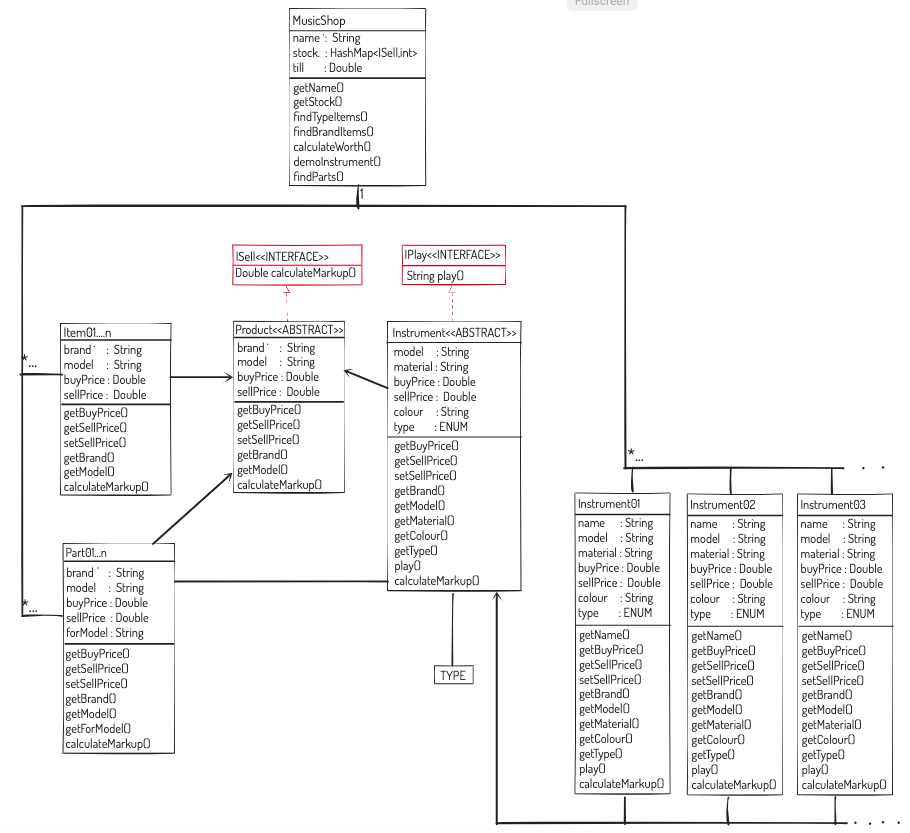

# Model of a music shop.

This shop should contain products which can be sold. 
These products might be instruments, which someone may play e.g. guitar, saxophone, piano, etc, or, they might be other products, e.g. guitar strings, drum sticks, sheet music etc. Each item which can be sold will have both a price at which the shop bought the item, and a price at which the item will be sold.

## MVP Requirements:

- [ ] Create a IPlay interface that could be applied to instruments. This should have a play method that returns the sound of the instrument played as a String.
- [ ] Create classes for different types of instruments e.g. guitars, pianos, etc. (any you can think of). 
- [ ] Each Class will have its own instance variables for attributes particular to that instrument e.g. a guitar may have a number of strings, a trumpet may have a number of valves etc.
- [ ] Create an Instrument superclass which contains attributes you see as being common to all instruments e.g. material it is made from, colour, type (Brass, String, Woodwind, Keyboard etc). The classes created in step 2 above can then inherit from Instruments class.
- [ ] Create a ISell interface which has a calculateMarkup method, which returns an int/double, based on the buying price and the selling price.
- [ ] Create classes for products the shop may sell, i.e. which implement the ISell interface. Such products should have the following:
- [ ] a type/description e.g. guitar, drum sticks, guitar strings, sheet music etc.
- [ ] a price at which the shop bought the item.
- [ ] a price at which the shop plans to sell the item.
- [ ] Some ISell products will be musical instruments i.e. instruments can be both IPlay and ISell.

- [ ] Create a Shop class, which has a collection of ISell products, called stock. In your shop you should be able to:
- [ ] add products to stock.
- [ ] remove products from stock.

### Possible Extensions:
- [ ] Using the calculateMarkup method for each item in stock, create a method which gives the total potential profit for the shop.
- [ ] Create and use an enum for instrument types e.g. keyboard, wind, brass etc
- [ ] Any other extensions you may wish to add.

### Remember: 
- [ ] Use TDD with separate test files for each class.
- [ ] Demonstrate polymorphism in a program (take screen-shot for PDA)
- [ ] An Inheritance Diagram  (take screen-shot for PDA)
- [ ] A Class (take screen-shot for PDA)
- [ ] A Class which inherits from the previous class (take screen-shot for PDA)
- [ ] An Object in the inherited class (take screen-shot for PDA)
- [ ] A Method that uses the information inherited from another class. (take screen-shot for PDA)

### Possible personal extras:  
- [ ] Demonstrate use of ENUM's
- [ ] Demonstrate use of streams
- [ ] Demonstrate use of HashMaps
- [ ] Demonstrate use of packages
- [ ] Demonstrate use of composition
- [ ] Demonstrate use of interfaces
- [ ] Demonstrate a search option
- [ ] Demonstrate use catching exceptions
- [ ] Demonstrate use of Singleton Pattern

### Planning:

- Diagram v1:
  

- Diagram v2:
  

- Diagram v3:
  

- Diagram v4:
  

